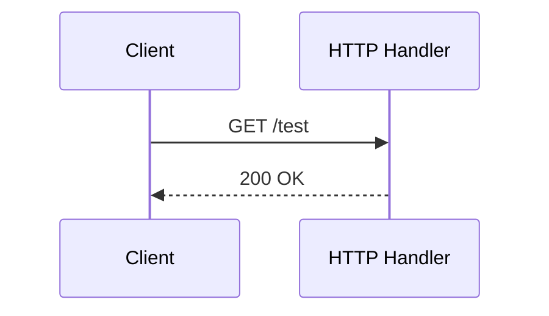

# Learning Log: Topic

- When: YYYY-MM-DD HH:MM TZ
- Topic: Short theme (e.g., Explore HTTP routing)
- File name: `YYYY-MM-DD-HHMM-topic.md`

## Goals
- [ ] Goal 1
- [ ] Goal 2
> Note: Briefly why these goals

## What I Tried (steps/tests)
- Bullet the actions you took
```shell
# Optional: commands you ran
go run ./cmd/app
curl -sS http://localhost:8085/test
```

## Findings / Insights
- Point 1
- Point 2 (stuck → workaround, etc.)

## Decisions (if any)
- Just the gist. For big choices, add a separate note.

## Next Steps
- [ ] TODO 1
- [ ] TODO 2

## Notes / Links
- URLs, related Issues/PRs



<!-- TODO: learning log ファイルを作ったらGithub actionで英語版が作られるようにしたい -->