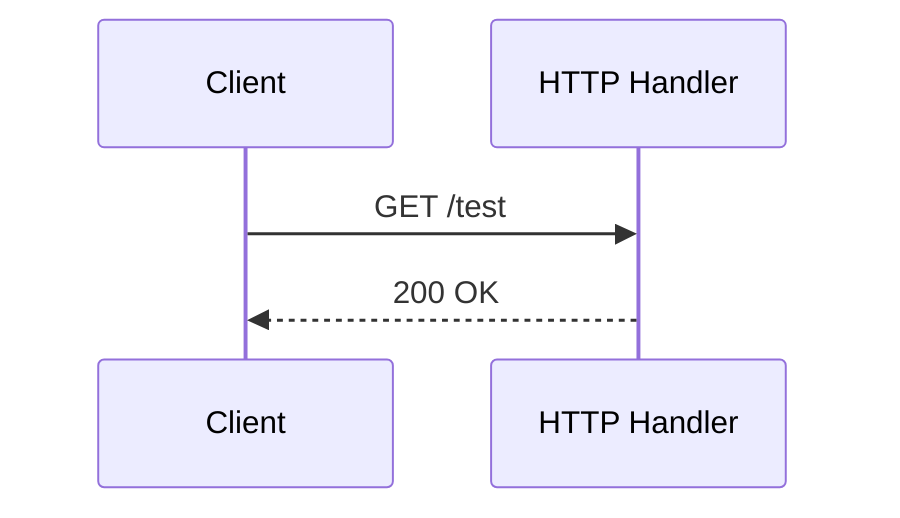

# Learning Log: トピック

- When: YYYY-MM-DD HH:MM TZ
- Topic: 簡単なテーマ名（例: HTTP ルーティング方針の検討）
- ファイル名推奨: `YYYY-MM-DD-HHMM-topic.md`

## 今日のゴール
- [ ] ゴール1
- [ ] ゴール2
> Note: なぜこのゴールか一言メモ

## やったこと（手順/検証）
- 実施した操作や試行を箇条書きで
```shell
# 任意: 実行したコマンド例
go run ./cmd/app
curl -sS http://localhost:8085/test
```

## 分かったこと / 気づき
- ポイント1
- ポイント2（詰まり→回避策 など）

## 決めたこと（あれば）
- 要点だけ。大きな判断は別ノートに詳しく書いてOK

## 次にやること
- [ ] TODO 1
- [ ] TODO 2

## メモ / リンク
- 参考URL、関連Issue/PR


